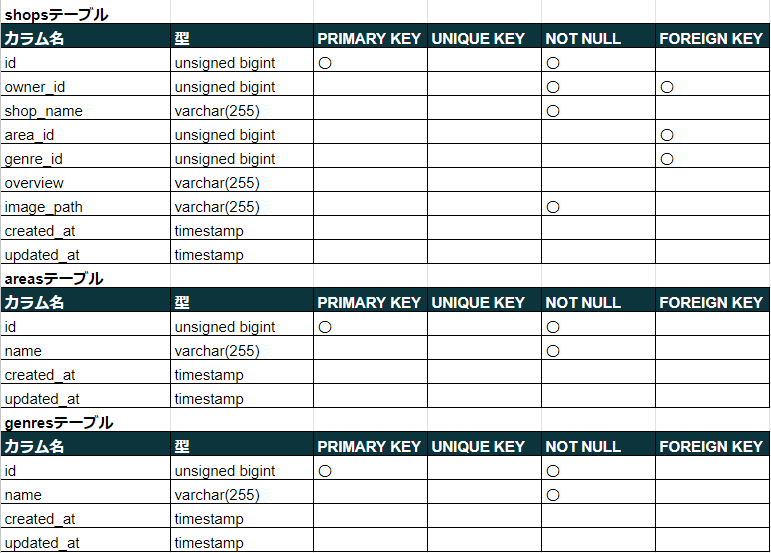
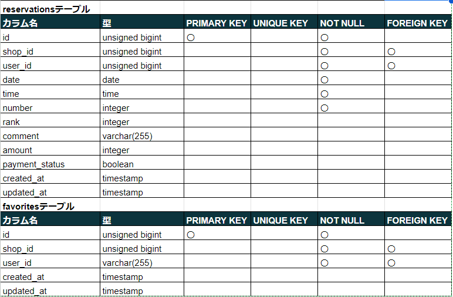
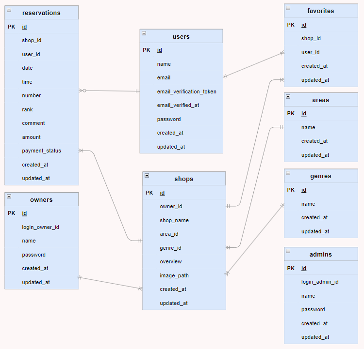
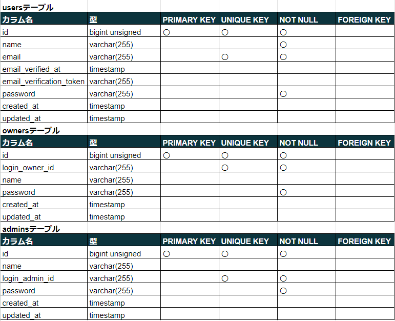

# サービス名
## Rese（リーズ）

飲食店予約サービス

## 機能一覧

### 一般ユーザーの機能
- 会員登録
- ログイン・ログアウト

http://localhost/login<br>
ダミーデータ<br>
Email:test@example.com　Password:12345678

**飲食店一覧ページ（一部ログイン不要）**
- エリア、ジャンル、店名で検索
- 飲食店お気に入り追加、削除

**飲食店詳細ページ（一部ログイン不要）**
- 飲食店予約(予約当日9:00メール通知)

**一般ユーザーマイページ**
- 飲食店お気に入り登録一覧取得、解除
- 飲食店予約情報取得、修正、削除
- 予約店でのチェックイン、決済
- 来店後評価、コメント

### shopオーナーの機能
- ログイン・ログアウト

http://localhost/owner/login<br>
ダミーデータ<br>
Owner ID:owner001　Password:owner001<br>
Owner ID:owner002　Password:owner002<br>
Owner ID:owner003　Password:owner003<br>
Owner ID:owner004　Password:owner004<br>
Owner ID:owner005　Password:owner005

**shop一覧ページ**
- shop情報登録、修正
- 予約一覧取得
- 支払金額登録、修正

### 管理者の機能
- ログイン・ログアウト

http://localhost/admin/login<br>
ダミーデータ<br>
Owner ID:admin001　Password:admin001

**shopオーナー一覧ページ**
- shopオーナー情報取得、登録

**一般ユーザーへお知らせメール作成ページ**

## 環境構築

**Docker ビルド**

1. GitHub からクローン

```bash
git clone git@github.com:yoshikiakazawa/Rese.git
```

2. DockerDesktop アプリを立ち上げる

3. 複数コンテナを一括で作成・起動

```bash
docker-compose up -d --build
```

> _Mac の M1・M2 チップの PC の場合、`no matching manifest for linux/arm64/v8 in the manifest list entries`のメッセージが表示されビルドができないことがあります。
> エラーが発生する場合は、docker-compose.yml ファイルの「mysql」内に「platform」の項目を追加で記載してください_

```bash
mysql:
    platform: linux/x86_64(この文追加)
    image: mysql:8.0.36
    environment:
```

**Laravel 環境構築**

1. PHPコンテナ内にログイン

```bash
docker-compose exec php bash
```

2. 必要なパッケージをインストール

```bash
composer install
```

3. 「.env.example」ファイルを 「.env」ファイルに命名を変更。または、新しく.env ファイルを作成

```bash
cp .env.example .env
```

4. .env に以下の環境変数を追加

**DB設定**
```text
DB_CONNECTION=mysql
DB_HOST=mysql
DB_PORT=3306
DB_DATABASE=laravel_db
DB_USERNAME=laravel_user
DB_PASSWORD=laravel_pass
```

**mail設定、stripe設定記載**

5. マイグレーションの実行

```bash
php artisan migrate
```

6. シーダーの実行

```bash
php artisan db:seed
```

7. アプリケーションキーの作成

```bash
php artisan key:generate
```


## 使用技術(実行環境)

- PHP 8.3.0
- Laravel 8.83.27
- MySQL 8.0.36

## テーブル設計





## ER 図



## URL

- 開発環境：http://localhost/
- phpMyAdmin：http://localhost:8080/

- 本番環境：
